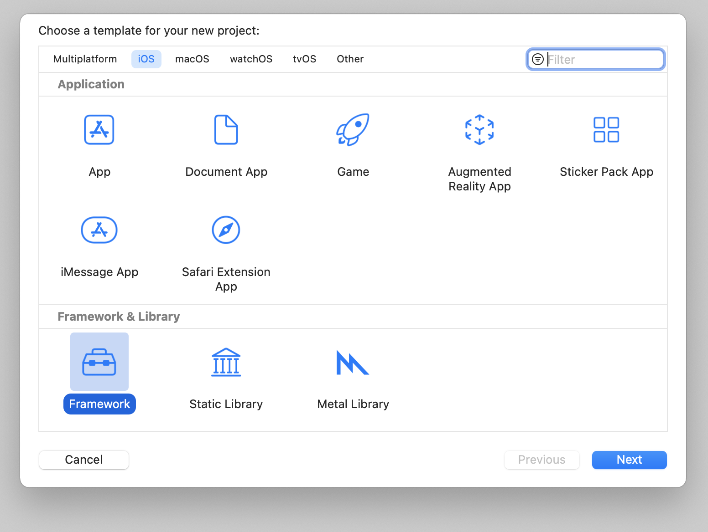

# Article

https://medium.com/flawless-app-stories/create-your-own-cocoapods-library-da589d5cd270

# #1 Create Framework



# #2 Create file and write code

```swift
public final class SwiftyLib {

    let name = "SwiftyLib"
    
    public func add(a: Int, b: Int) -> Int {
        return a + b
    }
    
    public func sub(a: Int, b: Int) -> Int {
        return a - b
    }
    
}
```

# #3 Git push

```bash
git init
git add .
git commit -m ""
git push ...
```

- add README & LICENSE

# #4 Pod Commands

```bash
gem install cocoapods # if not installed
pod spec create SwiftLibPaige

```

# #5 Edit podspec

```
Pod::Spec.new do |spec|

  spec.name         = "SwiftLibPaige"
  spec.version      = "0.0.1"
  spec.summary      = "A CocoaPods library written in Swift"

  spec.description  = <<-DESC
This CocoaPods library helps you perform calculation.
                   DESC

  spec.homepage     = "https://github.com/paigeshin/create-pod"
  spec.license      = { :type => "MIT", :file => "LICENSE" }
  spec.author       = { "paigeshin" => "paigeshin1991@gmail.com" }

  spec.ios.deployment_target = "12.1"
  spec.swift_version = "4.2"

  spec.source        = { :git => "https://github.com/paigeshin/create-pod.git", :tag => "#{spec.version}" }
  spec.source_files  = "SwiftLib/**/*.{h,m,swift}"

end
```

# #6 Pod Lint

```bash
pod lib lint #pod validation

git add .
git commit -m "Added SwiftyLib.podspec"
git push
```

# #7 Publish

```bash
git tag 0.0.1
git push origin 0.0.1
pod trunk push
```